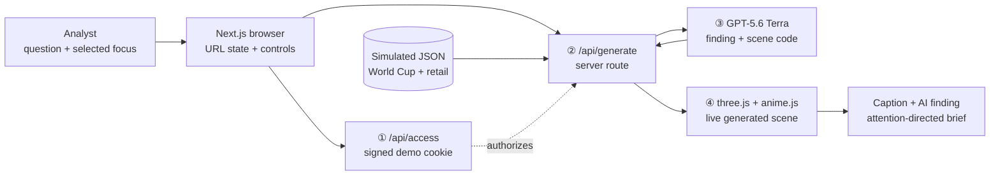
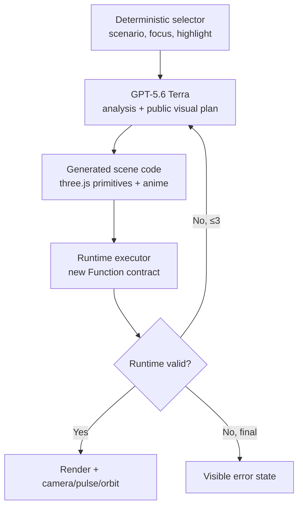
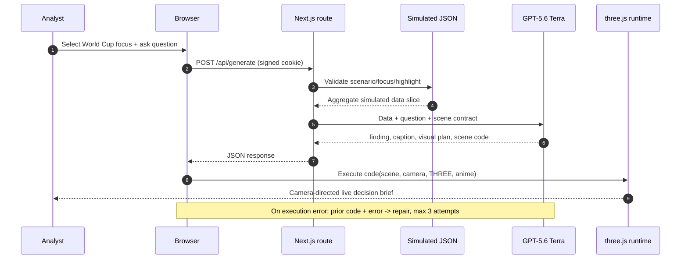

# Submission diagrams

## System architecture



## AI component topology



## Request handshake



## One-page infographic copy

Use this as a single 16:9 submission image or video title card.

```text
INSIGHTMOTION
Ask data. GPT directs attention.

STALE SCREENSHOT  →  LIVE DECISION BRIEF

① Ask                    ② Generate                    ③ See what matters
Plain-language question   GPT-5.6 Terra returns         Camera, pulse, color,
about selected data       insight + executable scene    caption guide attention

WORLD CUP 2026 REVIEW
104 simulated matches · 4 analyst views · 2 business scenarios

Next.js → GPT-5.6 Terra → three.js + anime.js → Vercel
```
