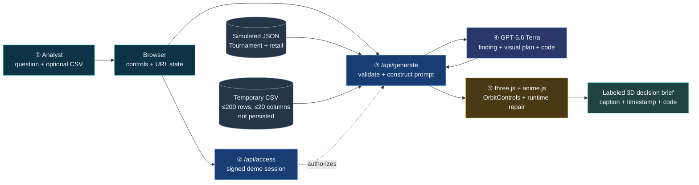
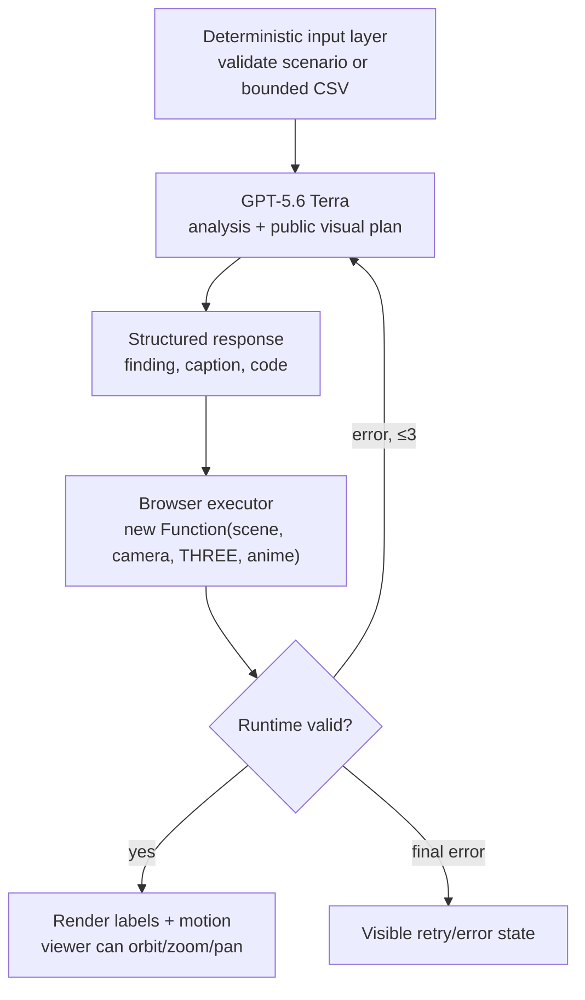
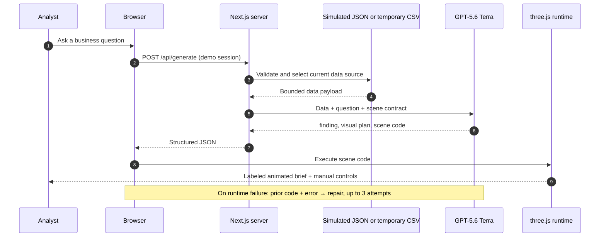

# InsightMotion submission diagrams

Use the same palette throughout: cyan for browser/user actions, blue for
server/model flow, gold for the generated focus, and slate for temporary data.

## System architecture



## AI component topology



## Request handshake



## One-page infographic copy

```text
INSIGHTMOTION
A CSV is not a decision.

UPLOAD OR CHOOSE DEMO DATA  →  ASK A QUESTION  →  GPT DIRECTS ATTENTION
Temporary CSV ≤200 rows        Plain language     Insight + code + 3D motion
Never stored                   No chart picker    Labels + camera + controls

104 simulated tournament matches · 4 analyst views · 2 business scenarios

Next.js → GPT-5.6 Terra → three.js + anime.js → Vercel
```
